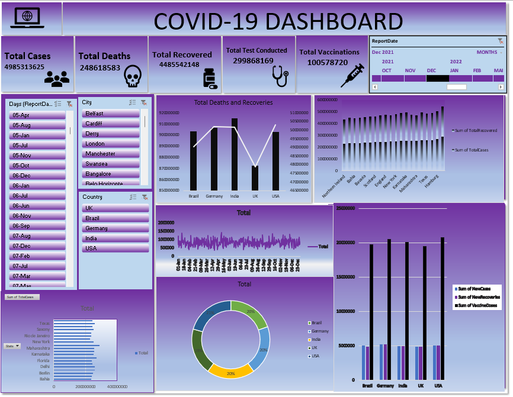

# 📊 COVID-19 Data Analysis Dashboard

## 📌 Project Overview
This project presents an interactive COVID-19 dashboard built using Power BI.
It visualizes total cases, deaths, recoveries, and vaccination data.

## 🚀 Key Features
- KPI Cards for Total Cases, Deaths, Recoveries & Vaccinations
- Dynamic Filters (Date, City, Country)
- Line, Bar and Donut Charts for trend analysis
- Comparative country-level insights

## 🛠 Tools Used
- Power BI
- Excel
- SQL

## 📷 Dashboard Preview

## 📈 Insights
- Identified trends in COVID-19 case growth
- Compared recovery and death rates across countries
- Analyzed vaccination progress

